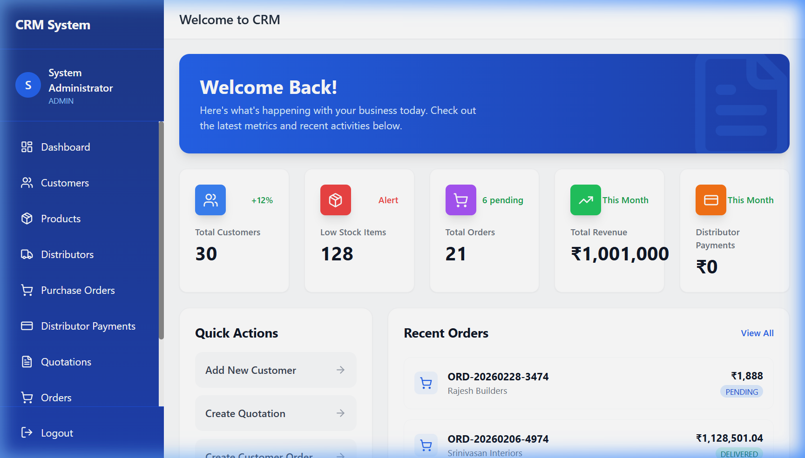
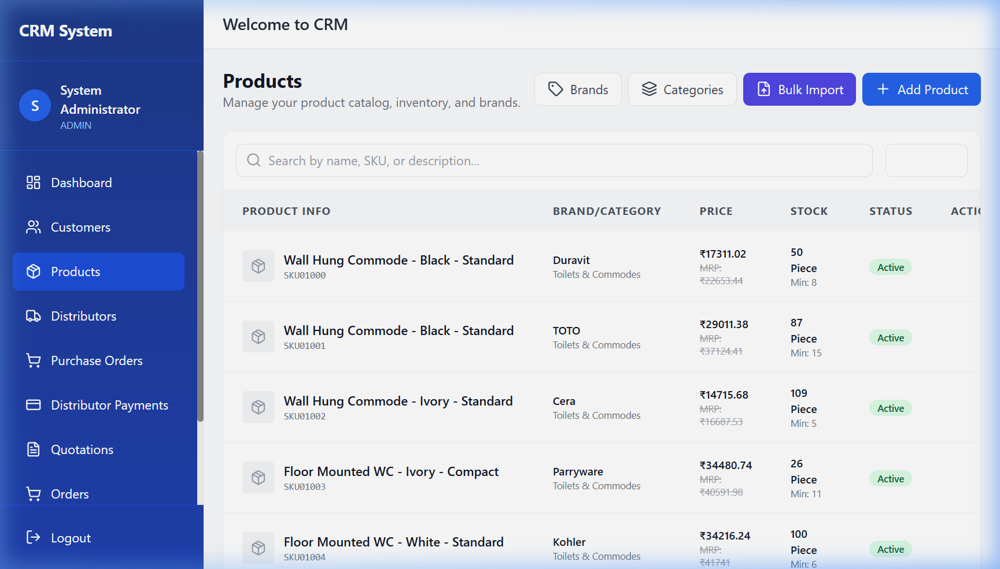
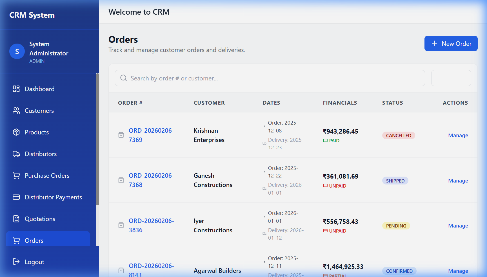
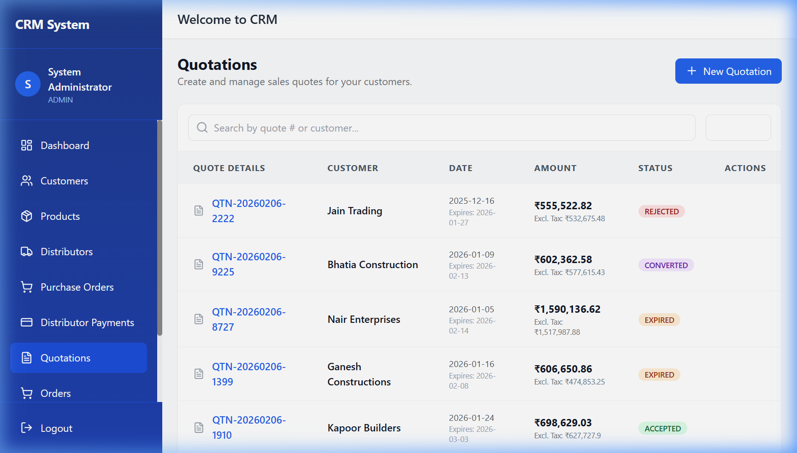

# Sanitaryware CRM System

Enterprise-level Customer Relationship Management system built specifically for sanitaryware retail businesses.

## Project Preview

| Dashboard | Products |
|-----------|----------|
|  |  |

| Orders | Quotations |
|--------|------------|
|  |  |

## Technology Stack

### Backend
- **Framework**: Java Spring Boot 3.2.2
- **Database**: MySQL 8.0+
- **Authentication**: JWT (JSON Web Tokens)
- **ORM**: Spring Data JPA with Hibernate
- **Build Tool**: Maven

### Frontend
- **Framework**: React 18 with Vite
- **Language**: JavaScript/TypeScript
- **Styling**: TailwindCSS
- **State Management**: Zustand
- **HTTP Client**: Axios
- **UI Components**: Shadcn/ui

### Mobile
- **Framework**: React Native with Expo
- **Navigation**: React Navigation
- **Authentication Storage**: AsyncStorage-backed JWT session
- **API Client**: Axios against the same Spring Boot REST API

## Features

- ✅ **User Management**: Role-based access control (Admin, Manager, Sales, Warehouse)
- ✅ **Customer Management**: Complete customer profiles with purchase history
- ✅ **Product Catalog**: Brand tracking, hierarchical categories, inventory management
- ✅ **Quotation System**: Create, send, and convert quotations to orders
- ✅ **Order Management**: Full order lifecycle tracking from creation to delivery
- ✅ **Payment Tracking**: Multiple payment methods with balance calculation
- ✅ **Inventory Management**: Stock tracking with low stock alerts
- 🚧 **Reports & Analytics**: Sales, customer, and inventory analytics
- 🚧 **Notifications**: WhatsApp and Email integration

## Prerequisites

- Java 17 or higher
- Maven 3.6+
- MySQL 8.0+
- Node.js 18+ and npm
- Git

## Setup Instructions

### Database Setup

1. Install MySQL and create the database:
```sql
CREATE DATABASE sanitaryware_crm CHARACTER SET utf8mb4 COLLATE utf8mb4_unicode_ci;
```

2. Update database credentials in `backend/src/main/resources/application.properties`:
```properties
spring.datasource.username=your_username
spring.datasource.password=your_password
```

### Backend Setup

1. Navigate to the backend directory:
```bash
cd backend
```

2. Build the project:
```bash
mvn clean install
```

3. Run the application locally with the development profile:
```bash
mvn spring-boot:run -Dspring-boot.run.profiles=dev
```

The backend will start on `http://localhost:8080`

For local QA without MySQL credentials, run the in-memory H2 profile:
```bash
mvn spring-boot:run -Dspring-boot.run.profiles=qa
```

The QA profile is intended for manual/mobile endpoint testing only. It starts with an empty in-memory database each run.

### Frontend Setup

1. Navigate to the frontend directory:
```bash
cd frontend
```

2. Install dependencies:
```bash
npm install
```

3. Start the development server:
```bash
npm run dev
```

The frontend will start on `http://localhost:5173`

### Mobile Android Setup

The mobile app lives in `mobile/` and reuses the existing Spring Boot API.
It is scaffolded on Expo SDK 55, which targets React Native 0.83 and requires Node.js 20.19.x or newer.

1. Navigate to the mobile directory:
```bash
cd mobile
```

2. Install dependencies:
```bash
npm install
```

3. Copy the mobile environment file and set the API URL:
```bash
copy .env.example .env
```

For Android Emulator, use:
```env
EXPO_PUBLIC_API_BASE_URL=http://10.0.2.2:8080/api
```

For a real Android phone on the same Wi-Fi, replace the host with your computer LAN IP:
```env
EXPO_PUBLIC_API_BASE_URL=http://192.168.1.10:8080/api
```

For production, use your deployed HTTPS backend URL.

4. Start Expo:
```bash
npm start
```

5. Run Android:
```bash
npm run android
```

## Default User Credentials

After first run, create an admin user via the `/api/auth/register` endpoint:

```json
{
  "username": "admin",
  "email": "admin@sanitaryware.com",
  "password": "Admin@123",
  "fullName": "System Administrator",
  "phoneNumber": "1234567890",
  "role": "ADMIN"
}
```

## API Documentation

### Authentication Endpoints

- `POST /api/auth/register` - Register new user
- `POST /api/auth/login` - User login
- `GET /api/auth/me` - Get current user

### Customer Endpoints

- `GET /api/customers` - List all customers
- `POST /api/customers` - Create customer
- `GET /api/customers/{id}` - Get customer details
- `PUT /api/customers/{id}` - Update customer
- `DELETE /api/customers/{id}` - Delete customer

### Product Endpoints

- `GET /api/products` - List all products
- `POST /api/products` - Create product
- `GET /api/products/{id}` - Get product details
- `PUT /api/products/{id}` - Update product
- `DELETE /api/products/{id}` - Delete product

### Order Endpoints

- `GET /api/orders` - List all orders
- `POST /api/orders` - Create order
- `GET /api/orders/{id}` - Get order details
- `PUT /api/orders/{id}` - Update order

### Quotation Endpoints

- `GET /api/quotations` - List all quotations
- `POST /api/quotations` - Create quotation
- `GET /api/quotations/{id}` - Get quotation
- `PUT /api/quotations/{id}` - Update quotation
- `POST /api/quotations/{id}/convert` - Convert to order

## Project Structure

```
SanitarywareCRM/
├── backend/
│   ├── src/main/java/com/sanitaryware/crm/
│   │   ├── config/          # Configuration classes
│   │   ├── controller/      # REST controllers
│   │   ├── dto/             # Data Transfer Objects
│   │   ├── entity/          # JPA entities
│   │   ├── repository/      # Data repositories
│   │   ├── security/        # Security & JWT
│   │   └── service/         # Business logic
│   └── pom.xml
├── frontend/
│   ├── src/
│   │   ├── components/      # React components
│   │   ├── pages/           # Page components
│   │   ├── services/        # API services
│   │   ├── store/           # State management
│   │   └── utils/           # Utility functions
│   └── package.json
└── README.md
```

## Configuration

### Email Configuration (Gmail)
Update in `application.properties`:
```properties
spring.mail.username=your-email@gmail.com
spring.mail.password=your-app-password
```

### WhatsApp Configuration (Twilio)
Update in `application.properties`:
```properties
twilio.account.sid=your-twilio-sid
twilio.auth.token=your-twilio-token
twilio.whatsapp.number=whatsapp:+14155238886
```

### JWT Secret
**Important**: Production requires `JWT_SECRET` to be provided as an environment variable. It must be at least 32 characters.

## Production Readiness

- Copy `backend/.env.example` and `frontend/.env.example` into your deployment environment and set real values there. Do not commit production secrets.
- The default backend profile uses `spring.jpa.hibernate.ddl-auto=validate`; manage schema changes with migrations or controlled SQL scripts.
- Public self-registration is disabled after the first bootstrap user. The first registered user becomes `ADMIN`; later registrations require an authenticated `ADMIN` or `MANAGER` and create `SALES` users.
- Set `CORS_ALLOWED_ORIGIN_PATTERNS` to the exact production frontend origin.
- Build checks:
```bash
cd backend && mvn test
cd frontend && npm run build
```

## License

Proprietary - All Rights Reserved

## Support

For support and questions, please contact your system administrator.
