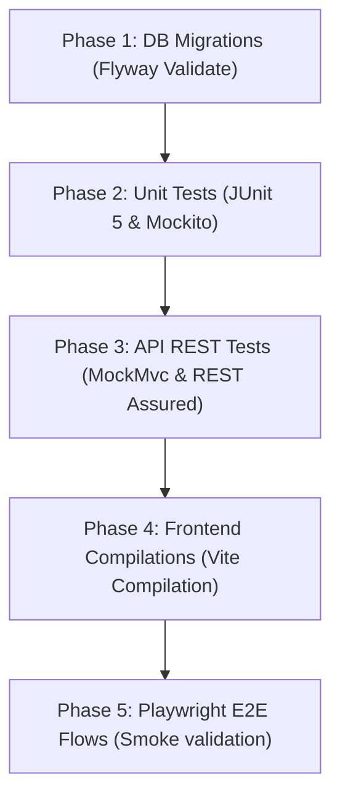

# TEST EXECUTION PLAN

This plan defines the sequence, configuration, and environment setup required to execute the Sanitaryware CRM test suites before production release.

---

## 1. Execution Environments

### Environment A: Local Dev/QA Test (In-Memory H2)
* **Purpose**: Running unit tests and controller integration tests locally without external services.
* **Backend Profile**: `dev`
* **Properties File**: `backend/src/main/resources/application-dev.properties`
* **Features**:
  * Flyway migrations run on empty H2 schema.
  * In-memory DB locks release automatically when test ends.

### Environment B: Staging/UAT (Local MySQL / Docker)
* **Purpose**: Complete end-to-end integration and user acceptance validation.
* **Backend Profile**: `default` (MySQL)
* **Database**: Standalone MySQL 8.0 schema named `sanitaryware_crm`.
* **Properties File**: `backend/src/main/resources/application.properties`

---

## 2. Phase-by-Phase Execution Order

Execute test suites sequentially to isolate system levels:



### Phase 1: Database Migration Verification
Validate that Flyway migration scripts build the tables correctly and schema changes are backwards-compatible:
```bash
cd backend
mvn flyway:clean flyway:migrate "-Dspring-boot.run.profiles=dev"
```

### Phase 2: Unit and Service Level Tests
Verify database calculations, optimistic locks, and validation handlers:
```bash
cd backend
mvn test
```

### Phase 3: Frontend Integration Compile
Compile React assets to verify imports, configurations, and lint rules:
```bash
cd frontend
npm run build
```

### Phase 4: E2E Smoke Tests (Vite + Playwright)
Start the local server and run headlessly simulating user registration, quotation convert, and payments:
```bash
# Terminal A (Start Dev Backend)
cd backend
mvn spring-boot:run "-Dspring-boot.run.profiles=dev"

# Terminal B (Start Dev Frontend)
cd frontend
npm run dev

# Terminal C (Run Playwright suite)
cd frontend
npx playwright test
```

---

## 3. CI/CD Integration (GitHub Actions)

Add this YAML config under `.github/workflows/verify-pipeline.yml` to trigger automation checks on every pull request:

```yaml
name: CRM Verification Pipeline

on: [push, pull_request]

jobs:
  backend-test:
    runs-on: ubuntu-latest
    steps:
      - uses: actions/checkout@v3
      - name: Setup Java 17
        uses: actions/setup-java@v3
        with:
          java-version: '17'
          distribution: 'temurin'
      - name: Run Backend Tests
        run: |
          cd backend
          mvn clean test

  frontend-build:
    runs-on: ubuntu-latest
    steps:
      - uses: actions/checkout@v3
      - name: Setup Node
        uses: actions/setup-node@v3
        with:
          node-version: '18'
      - name: Compile Frontend
        run: |
          cd frontend
          npm install
          npm run build
```
